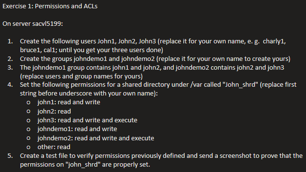

# Practice 1 — User Management & ACLs

## Exercise



## Notes & Commands

### User management

```bash
useradd username
userdel username
cat /etc/passwd   # user credentials
cat /etc/group    # groups
gpasswd -d username group   # remove user from group
useradd -aG group username  # add user to a supplementary group
```

### ACLs (Access Control Lists)

```bash
setfacl -m u:user:permissions /path/to/file   # -m modifies the ACL
setfacl -m g:group:permissions /path/to/file
getfacl /path/to/file                          # show the ACL
```

**The mask** is the maximum permission that can be granted by any ACL entry,
other than the file owner or an "other" entry — it caps what named users and
groups can be given, even if their individual entry allows more.

## Summary

- Created three users and two groups, assigned group membership.
- Built a shared directory under `/var` with per-user and per-group ACLs
  (mixed read / write / execute) using `setfacl`.
- Verified the effective permissions with `getfacl` and a test file.
