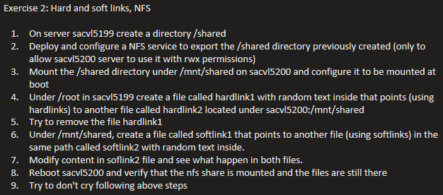

# Practice 2 — NFS & Hard/Soft Links

## Exercise



## Notes & Commands

### NFS server setup

```bash
sudo dnf install nfs-utils -y
sudo systemctl start nfs-mountd
sudo systemctl start nfs-server
sudo systemctl enable nfs-mountd
cat /proc/fs/nfsd/versions   # verify supported NFS versions
```

``` bash
vi /etc/exports
/shared         10.x.x.x/21(rw,sync)

exportfs -ra    # (re)export everything listed in /etc/exports
exportfs -v     # verify
```

```bash
firewall-cmd --permanent --add-service nfs   # open the relevant firewall ports
firewall-cmd --reload
```
### Mounting on the client

```bash
cd /mnt
mkdir shared
mount host.com:/shared /mnt/shared

sudo vi /etc/fstab host.com:/shared /mnt/shared   nfs   rw,_netdev   0 0
# _netdev tells the system to wait for networking before attempting the mount
```
### Hard & soft links

```bash
ln link1 /mnt/shared/hardlink
ln -s target /mnt/shared/softlink
```

- A **hard link** always points a filename directly to data on the storage
  device (same inode) — deleting the original name doesn't remove the data
  as long as another hard link exists.
- A **soft (symbolic) link** points a filename to another *filename*, which
  in turn points to the data — if the target filename is removed, the soft
  link breaks.

> **Inodes** hold a file's metadata and the pointers to its data blocks;
> hard links are just extra directory entries pointing to the same inode.

## Summary

- Deployed and exported an NFS share, opened the firewall for it.
- Mounted it persistently on the client via `/etc/fstab` with `_netdev`.
- Demonstrated the practical difference between hard and soft links,
  including what happens to each when the original file is removed.
