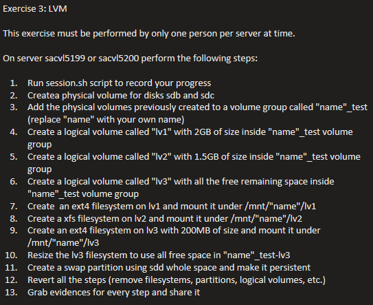
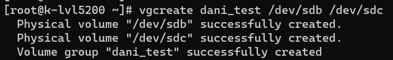
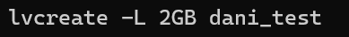
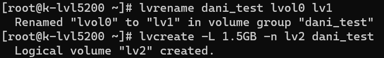
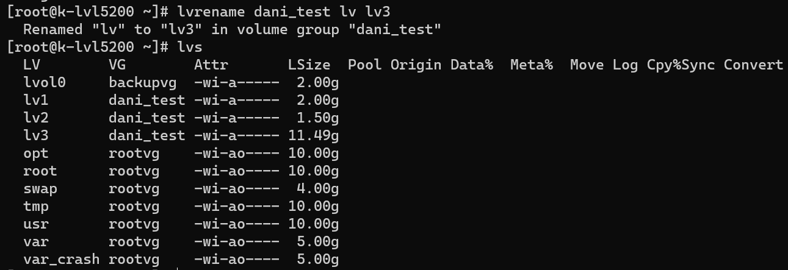
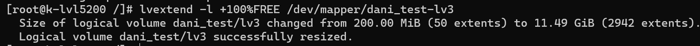
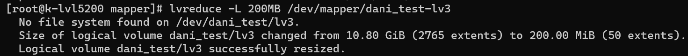
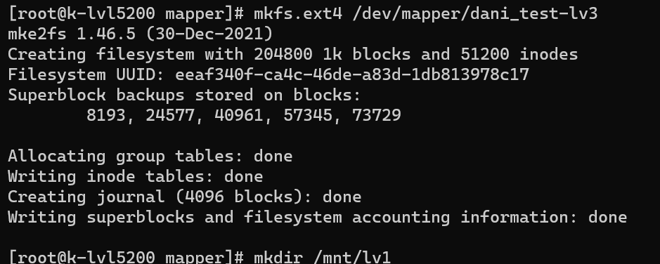
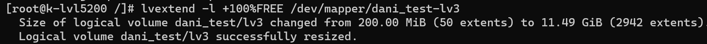
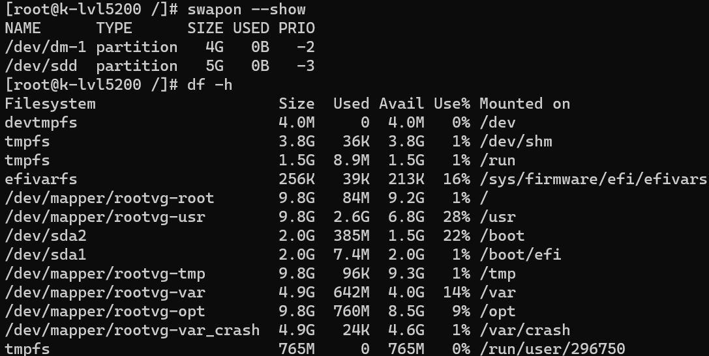

# Practice 3 — LVM (Logical Volume Management)

## Exercise



## Notes & Commands

```bash
vgcreate dani_test /dev/sdb /dev/sdc
lvcreate -L 2GB -n lv1 dani_test
lvcreate -L 1.5GB -n lv2 dani_test
lvcreate -l +100%FREE -n lv3 dani_test

mkfs.ext4 /dev/mapper/dani_test-lv1
mkfs.xfs  /dev/mapper/dani_test-lv2
mkfs.ext4 /dev/mapper/dani_test-lv3

lvreduce -L 200MB /dev/mapper/dani_test-lv3

mkdir /mnt/dani/lv1
mkdir /mnt/dani/lv2
mkdir /mnt/dani/lv3

lvextend -l +100%FREE /dev/mapper/dani_test-lv3

fdisk /dev/sdd
mkswap /dev/sdd
swapon /dev/sdd

mount /dev/dani_test/lv1 /mnt/dani/lv1
mount /dev/dani_test/lv2 /mnt/dani/lv2
mount /dev/dani_test/lv3 /mnt/dani/lv3

vi /etc/fstab
```

Resize a logical volume and grow its filesystem in one step:

```bash
lvextend -r -L +<size> /dev/mapper/dani_test-lv3
# -r resizes the underlying filesystem to match the new LV size
```

## Evidence











## Summary

- Built a volume group from two disks, carved out three logical volumes
  (one sized explicitly, one using the remaining free space).
- Formatted with a mix of `ext4` and `xfs`, reduced and then grew `lv3`.
- Created and activated a swap partition on a fourth disk.
- Mounted everything persistently via `/etc/fstab`.

See [Practice 4](../04-ansible-lvm-automation/) for an Ansible playbook that
automates this entire exercise (and reverses it).
