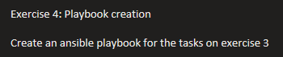

# Practice 4 — Ansible Automation of the LVM Exercise

## Exercise



This practice re-implements everything done by hand in
[Practice 3 — LVM](../03-lvm/) as an idempotent Ansible playbook.

## Playbooks

- [`playbooks/setup.yml`](playbooks/setup.yml) — creates the volume group,
  the three logical volumes, formats them (`ext4`, `xfs`, `ext4`), mounts
  them, resizes `lv3` to use all remaining free space, and creates/activates
  a swap partition.
- [`playbooks/cleanup.yml`](playbooks/cleanup.yml) — reverses all of the
  above: unmounts, removes the `/etc/fstab` entries, disables and removes
  swap, deletes the logical volumes, the volume group, and the physical
  volumes.

```bash
ansible-playbook playbooks/setup.yml
ansible-playbook playbooks/cleanup.yml
```

### Verifying the result

```bash
vgs
lvs
cat /etc/fstab
swapon --show
lsblk -f
```

## Notes (Ansible modules)

**¿What is a module?** A tool that performs a single task. 

| Módulo       | Qué hace               |
| ------------ | ---------------------- |
| `command`    | ejecuta comandos       |
| `shell`      | comandos con pipes     |
| `lvol`       | gestiona volúmenes LVM |
| `mount`      | monta filesystems      |
| `filesystem` | crea el filesystem     |

Se dividen en `[colección].[módulo]`, por ejemplo `community.general.lvol`.
Los **built-in** ya vienen incluidos en Ansible; las **collections** son
externas, como `community.general.lvol` y `ansible.posix.mount`.

### Estados (`state:`)

| Estado      | Significado    |
|-------------|-----------------|
| `present`   | que exista      |
| `absent`    | que no exista   |
| `mounted`   | montado         |
| `unmounted` | desmontado      |
