# Practice 5 — Networking: Virtual Interfaces, Bonding & VLANs

## Exercise

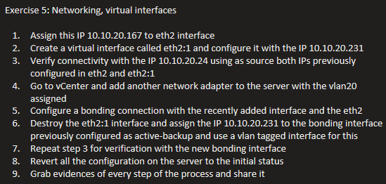

## Notes & Commands

### Checking interfaces / IPs

```bash
ip addr show
ip link show
```

### Netplan

```bash
netplan try     # apply temporarily, auto-rollback if not confirmed
netplan apply
```

### Base config — static IP + virtual (secondary) interface

```yaml
network:
  version: 2
  renderer: networkd
  ethernets:
    ens33:
      addresses:
        - 10.106.230.175/24
      nameservers:
        addresses:
          - 10.3.8.201
          - 10.4.8.28
      routes:
        - to: default
          via: 10.106.230.1
    ens35:
      addresses:
        - 10.106.244.167/23
        - 10.106.244.174/23:
            label: ens35:1   # virtual interface
```

**Verifying connectivity using both IPs as source:**

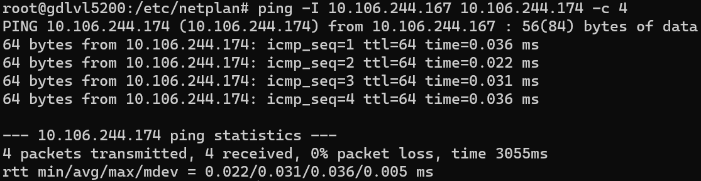
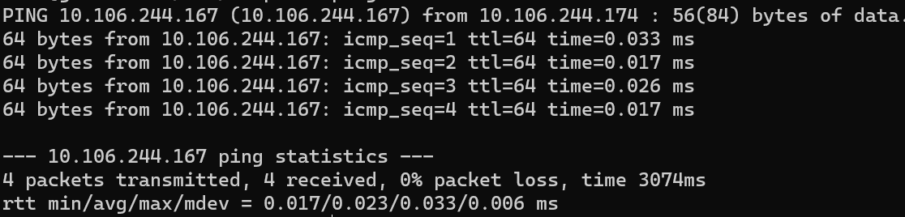

### Bond configuration (active-backup)

```yaml
network:
  version: 2
  renderer: networkd
  ethernets:
    ens35:
      dhcp4: false
    ens36:
      dhcp4: false
  bonds:
    bond0:
      interfaces:
        - ens35
        - ens36
      parameters:
        mode: active-backup
        primary: ens35
        mii-monitor-interval: 100
        fail-over-mac-policy: active
      dhcp4: false
      addresses:
        - 10.106.244.174/23
```

### Tagged VLAN on top of the bond

```yaml
network:
  version: 2
  ethernets:
    ens33:
      addresses:
        - 10.106.230.175/24
      nameservers:
        addresses:
          - 10.3.8.201
          - 10.4.8.28
        search:
          - americas.ad.flextronics.com
          - gdl.flextronics.com
          - k-l.flex.com
      routes:
        - to: default
          via: 10.106.230.1
    ens35:
      dhcp4: false
    ens36:
      dhcp4: false
  bonds:
    bond0:
      interfaces:
        - ens35
        - ens36
      parameters:
        mode: active-backup
        primary: ens35
        mii-monitor-interval: 100
        fail-over-mac-policy: active
      dhcp4: false
      addresses:
        - 10.106.244.174/23
  vlans:
    bond0-vlan925:
      id: 925
      link: bond0
```

### Useful one-liners while testing

```bash
watch -n .1 "ip a | grep -w inet"
df -Th /var
df -h .
```

## Evidence

**Ping from server to `ens35` (.167):**

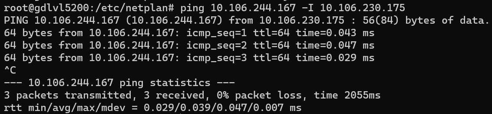

**Ping from server to `bond0` (.174):**

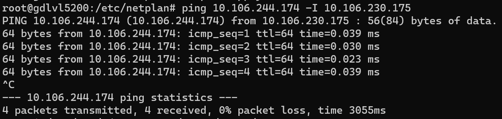

**Additional connectivity / bonding verification:**

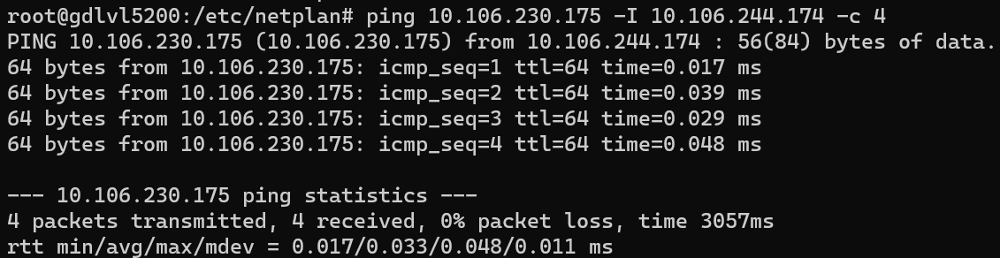
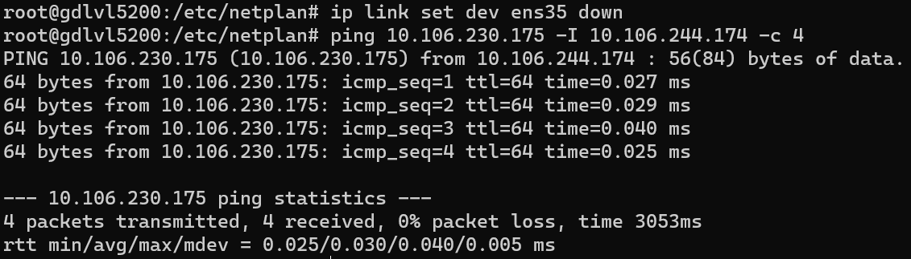
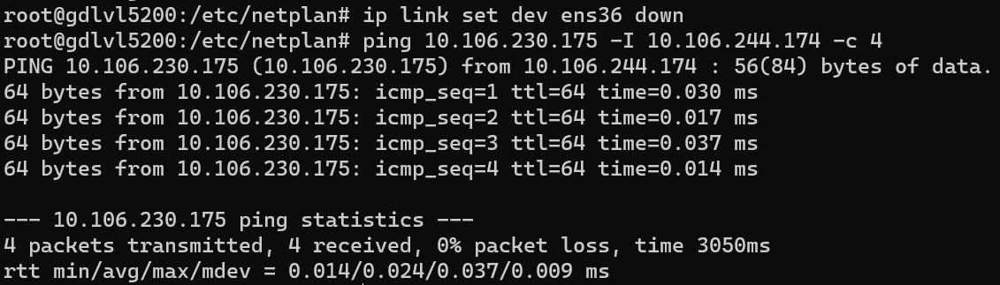
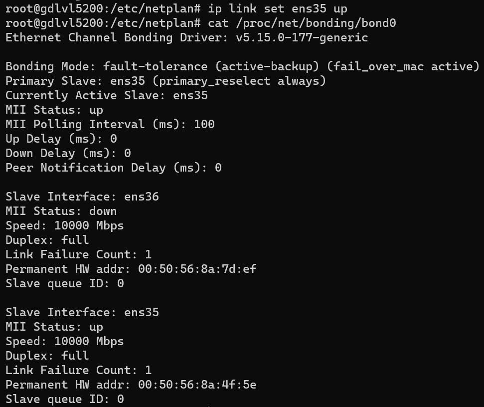
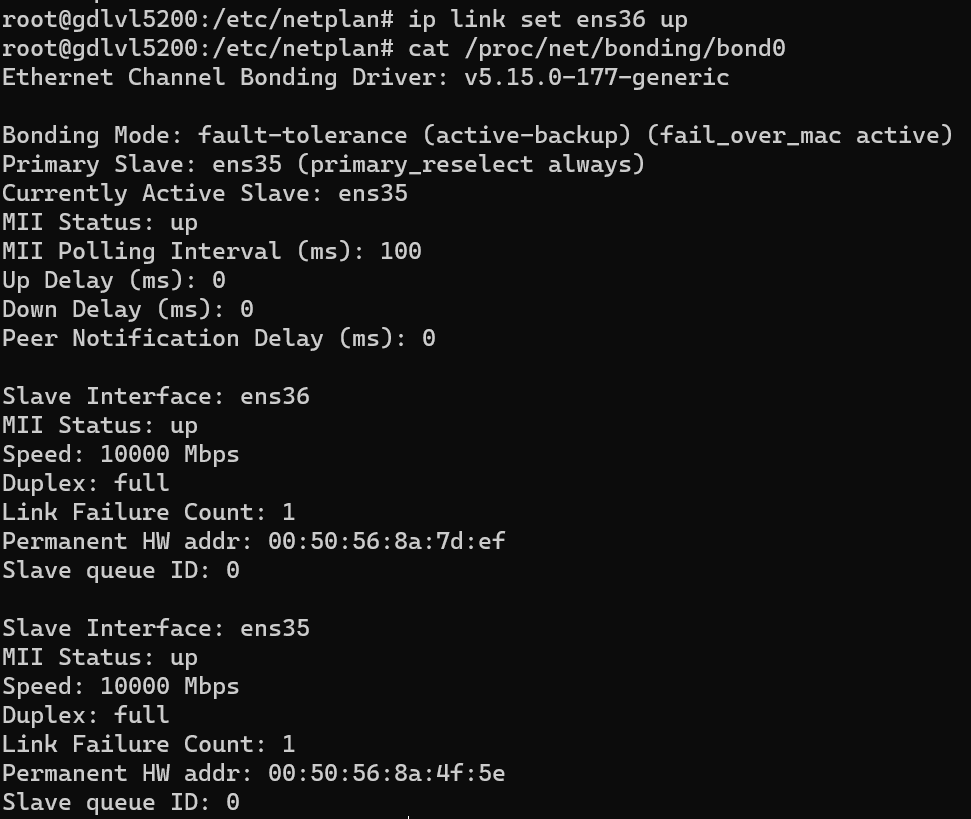
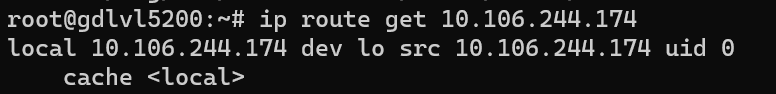

## Summary

- Assigned a static IP and added a secondary (virtual, `:1`) address on the
  same interface, then verified connectivity sourced from both.
- Built an `active-backup` bond across two NICs and moved the secondary IP
  onto it.
- Added a tagged VLAN interface on top of the bond and reverted the server
  back to its original network configuration afterwards.
